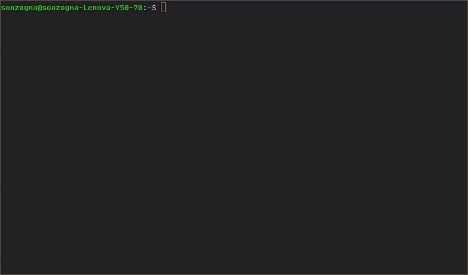

rgb-tui
-------------

A color picker with a terminal UI. Build with [FTXUI].



See [youtube]
[youtube](https://www.youtube.com/watch?v=ERtUrToBWEM)

Install
-------

[](https://snapcraft.io/rgb-tui)
```bash
sudo snap install rgb-tui
```

[youtube]:https://www.youtube.com/watch?v=ERtUrToBWEM)
[FTXUI]:https://github.com/ArthurSonzogni/FTXUI
