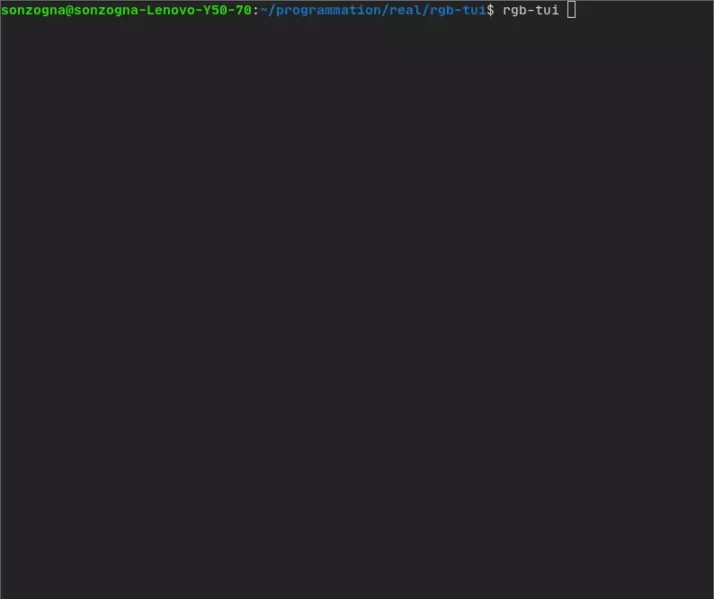

rgb-tui
-------------

A color picker with a terminal UI. Built with [FTXUI](https://github.com/ArthurSonzogni/FTXUI)



See [youtube](https://www.youtube.com/watch?v=ERtUrToBWEM)


Install
-------
Options:
- [Binaries](https://github.com/ArthurSonzogni/rgb-tui/releases): Window/Linux/Mac. Formats: zip/deb/rpm/sh/tar-gz/...
- Install from app stores: [Snapcraft](https://snapcraft.io/rgb-tui), [Arch linux](https://aur.archlinux.org/packages/rgb-tui-git/), ...

[](https://snapcraft.io/rgb-tui)
[](https://aur.archlinux.org/packages/rgb-tui-git/)

```bash
sudo snap install rgb-tui
```
- Compile from source

